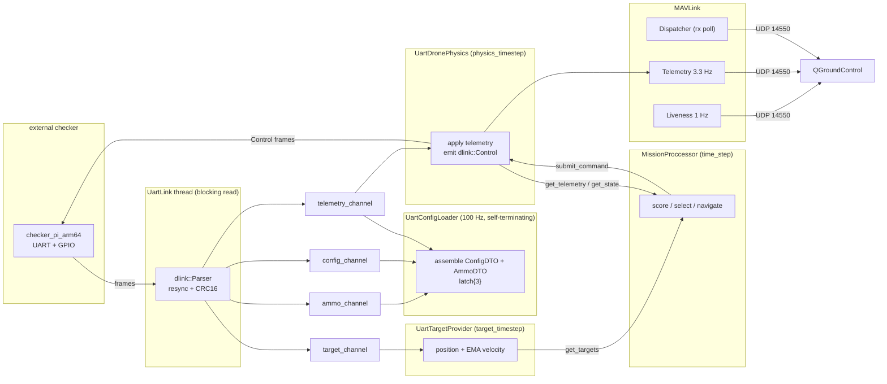
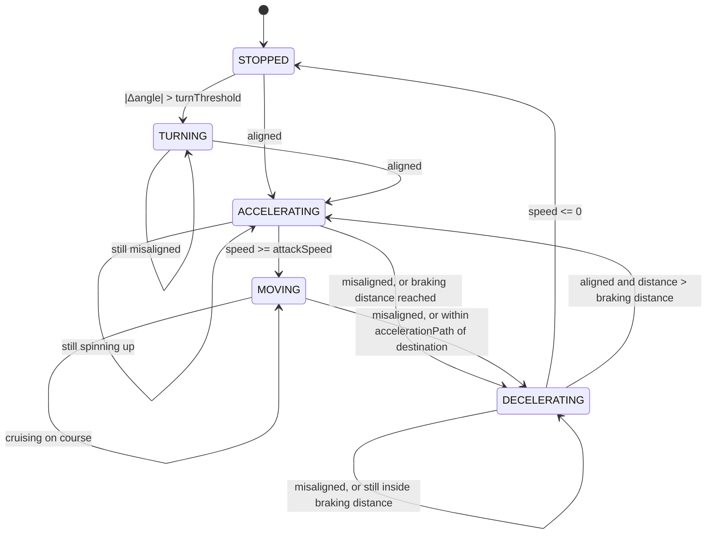

# drone_balistic_cpp

A C++20 autonomous strike simulator. A drone flies over a plane, tracks several moving
ground targets, and continuously re-solves the question *"which target can I hit soonest,
and from exactly which point must I release the munition so that gravity and drag carry it
onto the target?"* It then drives itself — via its own state machine — to that release
point and drops.

The same mission logic runs in two worlds:

* **offline** — everything (config, targets, drone physics) comes from JSON files and is
  simulated in-process;
* **hardware-in-the-loop (HIL)** — config, targets and telemetry arrive over a binary UART
  protocol from an external checker/simulator, control frames are sent back, and two GPIO
  lines carry the start/drop handshake.

Live flight is mirrored to QGroundControl over MAVLink/UDP, and the whole run is dumped to
`simulation.json` (or POSTed to a grading API) for replay.

---

## Table of contents

1. [What the program actually does](#what-the-program-actually-does)
2. [Module layout](#module-layout)
3. [Async architecture](#async-architecture)
4. [Drone state machine](#drone-state-machine)
5. [Ballistics: firepoint, solvers, table interpolation](#ballistics)
6. [Mission loop: scoring, prediction, target locking](#mission-loop)
7. [UART protocol](#uart-protocol)
8. [MAVLink and QGroundControl](#mavlink-and-qgroundcontrol)
9. [Configuration](#configuration)
10. [Build](#build)
11. [Run](#run)
12. [Output and visualization](#output-and-visualization)
13. [Tooling](#tooling)

---

## What the program actually does

Per mission tick (default 0.1 s of simulated time):

1. Read the current drone telemetry (position, heading, speed, altitude) and the current
   list of tracked targets (position + estimated velocity).
2. Ask the **ballistic solver** how long the munition falls from the current altitude at
   attack speed, and how far downrange it travels while falling — `FallResult{time, distance}`.
3. For every target, ask the **firepoint provider** for a `BallisticSolution`: the release
   point `fire_`, plus an optional `intermididate_` waypoint when the geometry does not
   allow a straight approach.
4. Ask the **solution evaluator** how many seconds it would take to fly there, given the
   real acceleration / deceleration / turning model. Infeasible solutions come back as
   `float::max()` and are filtered out.
5. **Re-solve with prediction**: the target will have moved by `time_taken + fall_time`, so
   score each target a second time against `target.approximate(time_taken + fall.time)`.
6. Pick the cheapest task, with hysteresis so the drone does not oscillate between targets.
7. Feed the active navigation point to the drone **state machine**, get back the next state
   and desired heading, and submit that as a `DroneCommand`.
8. Log the step.

The loop stops when the drone crosses its own fire point (within a tolerance derived from
speed, tick length and command latency), when `MAX_ITERATIONS` is exhausted, or when the
90 s mission timeout expires. On stop, the drop is signalled: MAVLink `COMMAND_LONG` to
the ground station and a GPIO pulse on the drop line.

---

## Module layout

| Module | Purpose |
|---|---|
| `drone_model` | Plain data types: `Coord`, `Ammo`, `Target`, `DroneSpec`, `DroneTelemetry`, `DroneCommand`, `Task`, `BallisticSolution`, `SimulationStep` |
| `drone_utils` | `ThreadWorker`, `ScheduledWorker`, `SynchronizedQueue`, geometry helpers (`Calc`) |
| `drone_state` | The five flight states and their transition logic |
| `drone_core` | Interfaces, DTOs, `MissionProccessor`, both ballistic solvers, firepoint provider, time evaluator, ballistic-table loader |
| `drone_service_json` | Offline data path: JSON `ConfigLoader`, simulated `DronePhysics`, replay-array `TargetProvider` |
| `drone_service_uart` | HIL data path: `UartConfigLoader`, `UartDronePhysics`, `UartTargetProvider` |
| `drone_transport` | `UartPort`/`UartLink` (framed binary protocol), `TcpPort`/`TcpLink` (HTTP), `UdpPort`/`UdpLink` (MAVLink), `GpioSignal`, `FdIo` |
| `drone_mavlink` | Heartbeat, telemetry, command-ack and dispatcher services on top of `UdpLink` |
| `drone_mission_factory` | Wires a whole mission together from a loader type + solver type |
| `drone_reporting` | `FileResultReporter` and `HttpResultReporter` over a shared JSON serializer |
| `external` | Vendored `json.hpp` and MAVLink `c_library_v2` |
| `data` | Sample config, ammo arsenal, target tracks, precomputed ballistic table |
| `docs` | Design notes (UART/GPIO HIL plan) |

Dependency direction is strictly one-way: `drone_core` defines the interfaces
(`IConfigLoader`, `ITargetProvider`, `IDronePhysics`, `IBallisticSolver`,
`IFirepointProvider`, `IBallisticSolutionEvaluator`), and both service modules implement
them. `MissionProccessor` never learns whether it is talking to a JSON file or a serial
cable.

---

## Async architecture

Everything that has its own clock is its own thread. There are two base classes in
`drone_utils`:

**`ThreadWorker`** — owns a `std::thread`, an atomic `running_` flag, and a pure virtual
`run_loop()`. `start(std::latch&)` spawns the thread; the thread first calls
`latch.arrive_and_wait()`, so a group of workers can be released together, then enters its
loop. The destructor sets `running_ = false` and joins.

**`ScheduledWorker : ThreadWorker`** — implements `run_loop()` as a fixed-period scheduler
around a pure virtual `tick()`, using `std::chrono::steady_clock` and `sleep_until` with an
absolute `next += period` deadline, so periods do not drift with the cost of `tick()`.

Threads never share mutable objects directly. They communicate through
**`SynchronizedQueue<T>`**, a mutex-guarded queue with an atomic counter and two drain
modes:

* `drain_to_last()` — take the newest item and discard the backlog. Used for state that is
  *latest-wins*: telemetry, control commands, config packets. A late consumer must never
  replay a stale command.
* `drain_all()` — take everything in order. Used for target position packets, where every
  sample matters because velocity is estimated from consecutive arrivals.

### Thread map (UART / HIL mode)



In JSON mode the picture is the same shape minus the link: `DronePhysics` integrates the
equations of motion itself instead of receiving them, and `TargetProvider` indexes a
precomputed position array instead of parsing packets.

### Startup ordering and the latch discipline

`ThreadWorker::start()` does **not** block — the spawned thread reaches
`latch.arrive_and_wait()` whenever the OS schedules it. If the caller returns before that
happens, the stack-local latch is destroyed under a live reference. `MissionFactory`
therefore always counts itself into the latch and arrives on it before moving on:

```cpp
auto link = std::make_shared<UartLink>(serial_device);
std::latch link_latch{2};          // worker + this thread
link->start(link_latch);
link_latch.arrive_and_wait();      // rendezvous, latch is now safe to destroy

auto loader = std::make_shared<UartConfigLoader>(link);
std::latch config_latch{2};
loader->start(config_latch);
config_latch.arrive_and_wait();
loader->wait_ready();              // blocks until ammo + config + first telemetry arrived

std::latch worker_latch{3};        // two workers + this thread, released together
target->start(worker_latch);
physics->start(worker_latch);
worker_latch.arrive_and_wait();
```

`UartConfigLoader` carries a second `std::latch ready_{3}` — one count each for the ammo,
config and telemetry packets. `wait_ready()` (an `IConfigLoader` hook that is a no-op for
JSON) blocks the main thread until all three have been seen, because `DroneSpec`,
`DroneTelemetry` and the tick periods of every downstream worker are derived from them.
Once all three arrive the loader calls `interrupt()` on itself and its thread exits — it is
a one-shot bootstrap worker, not a steady-state one.

### Mission thread and shutdown

`MissionProccessor` runs its own thread rather than deriving from `ScheduledWorker`,
because it needs a compound exit condition:

```cpp
for (int iter = 0; running_ && iter < max_iterations
                   && clock::now() < deadline && !has_finished(); ++iter) {
  step();
  next += period;
  std::this_thread::sleep_until(next);
}
```

Period is `time_step_ / timescale_` — the wall-clock period, so `timeScale: 10` runs ten
times faster than real time. `main()` calls `sim.mission->join()` and blocks there until
the drone reaches its fire point; only then does it send the MAVLink fire command and pulse
the GPIO drop line. Every worker's destructor interrupts and joins, so teardown is
deterministic as the `SimulationBundle` unwinds.

### Locking rules

Each provider guards its own state with fine-grained mutexes — `tel_mtx_` for telemetry,
`command_mtx_` for the active command, `mtx_` for the target map — and getters return **by
value**, never by reference. The mission thread therefore works on a consistent snapshot
and never holds a lock while computing. No lock is ever held across a queue operation, and
no two mutexes are ever taken in different orders, so the design has no lock-ordering
hazard by construction.

---

## Drone state machine

Five states live in `drone_state`, all implementing `IState`:

```cpp
class IState {
public:
  virtual const StateDecision decide(const DroneSpec&, const DroneTelemetry&,
                                     const Coord& dest, bool decelerate_in_dest) const = 0;
  virtual std::string name() const = 0;
  virtual DroneMode mode() const = 0;
};
```

Each state is a **stateless flyweight singleton** (`StateMoving::get_instance()`), so a
`StateDecision` is just `{const IState* next_state_, float dir}` — a pointer and a heading,
cheap to pass between threads. The machine holds no data; all data lives in the telemetry
snapshot passed in. Nothing is allocated per tick.



Two quantities drive every transition:

* **Heading error** `Δ = atan2(sin(target-current), cos(target-current))`, wrapped to
  `[-π, π]` by `Calc::calculate_turning_angle`. If `|Δ| > turnThreshold` the drone must
  bleed speed and rotate — this model has no banked turns, the drone stops to turn.
* **Braking distance** `v² / (2a)`, with `a = attackSpeed² / (2 · accelerationPath)`
  derived once in `DroneSpec`'s constructor. Specifying the acceleration *path* rather than
  the acceleration itself makes configs geometric and intuitive.

The `decelerate_in_dest` flag is the interesting part. It is set only while an intermediate
waypoint is pending, and it means *arrive at this point with zero velocity*. At the actual
fire point the opposite is required: the drone must cross it at full attack speed, because
the whole ballistic solution assumed the munition is released at `attackSpeed`. So the
final leg passes `false` and the drone flies straight through the release point.

State ownership is split: the state machine **decides**, the physics layer **executes**.
`MissionProccessor` calls `decide()` and submits the resulting `DroneMode` + heading as a
`DroneCommand` into the physics queue. `DronePhysics::get_state()` maps the last accepted
command's mode back to a state singleton, so the machine's "current state" is always the
state the physics layer actually acted on — never a local variable that could drift out of
sync across threads.

In HIL mode `UartDronePhysics::to_control()` lowers the same `DroneCommand` onto the wire
protocol's normalized `Control{accel, turnRate}`: `accel` is `+1` for
`ACCELERATING`/`MOVING` and `-1` otherwise, `turnRate` is the heading error scaled by how
much rotation fits into one tick (`angularSpeed · idle_`) and clamped to `[-1, 1]`.

---

## Ballistics

### Stage 1 — the fall

`IBallisticSolver::fall(ammo, altitude, speed) -> FallResult{time, distance}` answers how
long the munition falls and how far it travels downrange, for a munition described by mass
`m`, drag `d` and lift `l`. Two implementations:

**`AnalyticalBallisticSolver`** solves the depressed-cubic form of the fall equation in
closed form (Cardano/trigonometric branch), then evaluates a polynomial series for the
downrange distance. Fast and dependency-free, but it is a series approximation, and outside
its domain the `acos` argument leaves `[-1, 1]` — the solver returns `{0, 0}` there rather
than a NaN.

**`TableBallisticSolver`** interpolates a precomputed 5-dimensional grid instead. This is
the default for the graded HIL runs: it is exact at the sample points, monotone between
them, and has no domain holes.

### Stage 2 — the ballistic table

`data/ballistic_table.txt` is a dense grid over `(altitude z, speed v, mass m, drag d, lift l)`:

```
11 10 5 3 2                                     <- nZ nV nM nD nL
50. 60. 70. ... 150.                            <- z axis, metres
1. 2. 3. ... 10.                                <- v axis, m/s
0.35 0.45 0.6 1.2 1.4                           <- m axis, kg
0.004 0.005 0.007                               <- d axis
0. 0.005                                        <- l axis
3.5045080212366058 2.8938155146905893           <- nZ*nV*nM*nD*nL pairs:
3.6201084533913095 14.596626942484109              time_to_fall, distance_to_fall
...
```

`load_ballistic_table()` reads the header, sizes each axis, then reads
`nZ·nV·nM·nD·nL` result pairs, throwing `std::runtime_error` on an unreadable or truncated
source. Values are stored flat, with the axis order fixed by

```cpp
index = ((((iz · |v| + iv) · |m| + im) · |d| + id) · |l| + il)
```

so `l` is the fastest-varying axis — which is exactly the order the interpolator collapses
them in.

`TableBallisticSolver::fall()` performs **pentalinear interpolation**: 2⁵ = 32 corner
samples reduced to one, one axis at a time.

```
32 corners  --lift-->  16  --drag-->  8  --mass-->  4  --speed-->  2  --altitude-->  1
```

Per axis, `find_interp(value, axis)` binary-searches with `std::lower_bound`, returns the
lower index and the fractional position within that cell, and **clamps** at both ends —
below the first sample it returns `{0, 0.0}`, above the last `{n-2, 1.0}`. Out-of-range
inputs therefore saturate to the nearest edge instead of extrapolating into nonsense. The
fraction is computed against the real gap `axis[i+1] - axis[i]`, so non-uniform axis spacing
(the mass axis `0.35, 0.45, 0.6, 1.2, 1.4` is quite non-uniform) is handled correctly.

Both solvers sit behind the same interface, so the choice is a single `SolverType` enum
value at factory time, and either can be hot-swapped mid-mission via
`IMissionProccessor::set_ballistic_solver()`.

### Stage 3 — the firepoint

`FirepointProvider::solve()` turns `FallResult.distance` into geometry. Let `D` be the
distance from the drone to the target and `R` the downrange fall distance. The release
point must be `R` short of the target, on the approach line.

* **Direct case** — if `R + remaining_acceleration_distance < D`, the drone can both reach
  attack speed and still have room to release. Fire point is
  `pos + (target - pos) · (D - R)/D`, no waypoint.
* **Overshoot case** — otherwise the drone is too close: it cannot be at attack speed by the
  time it must release. The provider inserts an **intermediate waypoint** behind the target
  at ratio `(R + accelerationPath)/D`, to be reached at zero velocity; the drone then
  accelerates from there along a fresh line and releases `R` short of the target.
* If the waypoint ratio would land past the target (`>= 1`), the provider degrades
  gracefully to the direct solution rather than producing an impossible plan.

### Stage 4 — cost

`BallisticSolutionEvaluator::calculate_time_taken()` prices a `BallisticSolution` in
seconds, using the same kinematics the state machine obeys, so the plan and the execution
agree:

* `calculate_time_to_turn()` — under `turnThreshold` the turn is free (snap) and speed is
  kept; otherwise the drone coasts `v²/(2a)` to a stop, turns at `angularSpeed`, and the
  cost is decel time + turn time, from the new stopping position.
* `calculate_time_to_reach()` — trapezoidal profile (accelerate → cruise → decelerate) when
  the distance allows it, triangular (accelerate → decelerate, peak below attack speed)
  when it does not. When the destination must be crossed at full speed and the remaining
  distance is shorter than the acceleration run, the leg is impossible and returns
  `float::max()`.
* A two-leg solution is priced as leg 1 (to the waypoint, `decelerate_in_dest = true`) plus
  leg 2 (waypoint to fire point, starting from zero, `decelerate_in_dest = false`). If
  leg 2 is impossible the whole task is.

`float::max()` and non-finite costs are filtered out by `is_task_possible()` before
anything is selected.

---

## Mission loop

`MissionProccessor::step()` is a ranges pipeline:

```cpp
auto view =
  targets
  | views::transform([&](const Target& t) { return pair{t, score(t.target_id_, t.pos_, tel, spec, fall)}; })
  | views::filter([&](const auto& p) { return is_task_possible(p.second); })
  | views::transform([&](const auto& p) {                       // re-solve against the
      const auto& [target, task] = p;                           // *predicted* position
      return score(target.target_id_,
                   target.approximate(task.time_taken + fall.time), tel, spec, fall);
    })
  | views::filter([&](const Task& t) { return is_task_possible(t); });
```

The double pass is the prediction: the first pass estimates flight time against where the
target *is*, the second solves properly against where it *will be* after the flight plus
the munition's fall — `pos + vel · (time_taken + fall_time)`.

`select_task()` then applies hysteresis so a moving field of targets does not make the drone
dither:

* **Lock-in** — once within `LOCK_FACTOR (2.0) × hitRadius` of the committed fire point, the
  current target is kept unconditionally.
* **Switch margin** — otherwise a challenger must be better than `SWITCH_FACTOR (0.5) ×`
  the current cost, i.e. at least twice as fast, to steal the commitment.

If nothing has ever been feasible (`current_task.id_ == -1`) the drone holds position rather
than flying somewhere arbitrary.

Waypoint arrival and fire-point crossing are both detected with
`Calc::point_to_segment_distance()` — against the **segment** between the previous and
current position, not the current position alone. At attack speed a tick can step several
metres, so a point-distance test would miss the crossing entirely. The fire tolerance is
`attackSpeed · (time_step + COMMAND_LATENCY)`, with `COMMAND_LATENCY = 0.15 s` accounting for
the measured GPIO/UART round trip between deciding to fire and the munition actually leaving.

---

## UART protocol

The checker and the drone talk over one serial port (115200 baud, raw mode). The definition
is in `drone_transport/include/DroneLink.hpp`, shared with the checker.

**Frame:**

| Bytes | Field | Notes |
|---|---|---|
| 0 | `MAGIC0` | `0xA5` |
| 1 | `MAGIC1` | `0x5A` |
| 2 | `TYPE` | packet type |
| 3 | `LEN` | payload length in bytes |
| 4 to 4+LEN-1 | payload | packed, little-endian |
| last 2 | `CRC16` | CRC-16/CCITT-FALSE (poly `0x1021`, init `0xFFFF`) over `TYPE`, `LEN` and payload, little-endian |

The parser resynchronises by searching for the magic bytes, and a frame with a bad CRC is
dropped without stopping the stream.

**Packet types:**

| Type | Name | Direction | Payload | Size |
|---|---|---|---|---|
| `0x01` | `PKT_TELEMETRY` | checker to drone | `t_ms u32`, `x y z f32`, `vx vy f32`, `speed f32`, `dir f32`, `state u8` | 33 B |
| `0x02` | `PKT_TARGET` | checker to drone | `id u8`, `x y f32`, sent periodically for each target | 9 B |
| `0x03` | `PKT_AMMO` | checker to drone | `name char[16]`, `mass drag lift hitRadius f32`, `nTargets u8`, sent once at start | 33 B |
| `0x04` | `PKT_RESULT` | checker to drone | `hit u8`, `targetId u8`, `miss_m f32`, `drop_t_ms u32`, verdict on real hardware | 10 B |
| `0x05` | `PKT_CONTROL` | drone to checker | `accel f32`, `turnRate f32`, both normalised to `[-1, 1]` | 8 B |
| `0x06` | `PKT_CONFIG` | checker to drone | `attackSpeed`, `accelerationPath`, `angularSpeed`, `turnThreshold`, `timeStep`, `timeScale`, all `f32`, sent once at start | 24 B |

**Startup and cycle:**

1. The drone raises `start_line`. The checker then sends `CONFIG` and `AMMO`, followed by
   continuous `TELEMETRY` and `TARGET` packets.
2. `UartLink` parses the stream on its own thread and pushes each packet type into its own
   queue. `UartDronePhysics` keeps only the latest telemetry and, each tick, turns the
   current state-machine command into a `CONTROL` packet (see the state machine section).
3. The checker scales `CONTROL` by the drone's physical limits. Acceleration is derived as
   `attackSpeed² / (2 · accelerationPath)`, since the config carries the path rather than
   the acceleration.

---

## MAVLink and QGroundControl

The drone appears in QGroundControl as a quadrotor and streams its position while the
mission runs. The code is in `drone_mavlink`, on top of `UdpLink` (a MAVLink framer over
`UdpPort`) and the vendored `c_library_v2`.

**Link:** the drone sends to `127.0.0.1:14550`, hardcoded in `src/Main.cpp` (`QGC_HOST`,
`QGC_PORT`). 14550 is the port QGroundControl listens on by default, so QGC must run on the
same machine. To use a QGC on another computer, change `QGC_HOST` to its IP and rebuild. The
socket is a UDP `connect()` to that peer with a random local port.

**Identity** (`MavlinkConstants.hpp`): system ID 1, component `MAV_COMP_ID_AUTOPILOT1`,
vehicle `MAV_TYPE_QUADROTOR`, autopilot `MAV_AUTOPILOT_GENERIC`, armed, `MAV_STATE_ACTIVE`.
Commands are addressed to system 255, component 190 (the ground station).

**Outgoing messages:**

| Message | Period | Content |
|---|---|---|
| `HEARTBEAT` | 1 s | identity and state above, keeps the vehicle connected in QGC |
| `GLOBAL_POSITION_INT` | 0.3 s | latitude, longitude, altitude, ground velocity and heading from the drone's telemetry |
| `ATTITUDE` | 0.3 s | yaw only (roll and pitch are 0) |
| `COMMAND_LONG` | once, at fire | `MAV_CMD_USER_1` with the fire point as latitude, longitude and altitude in `param5` to `param7` |

**Coordinates:** the simulation is in metres, so positions are mapped to geographic
coordinates around a base point, Kyiv (50.4501 N, 30.5234 E). `x` is east, converted with the
cosine-corrected longitude scale, and `y` is north, at 111,320 m per degree of latitude.
Heading is converted from mathematical radians (0 = east) to a compass bearing in degrees
(0 = north), and yaw is wrapped to `[-π, π]`.

**Receiving:** `MavlinkDispatcherService` reads incoming UDP datagrams and routes each
message to a handler registered by message ID. Currently `COMMAND_ACK` is routed to
`MavlinkCommandService`.

**Fire command handshake:** after the mission reaches the fire point,
`MavlinkCommandService::command_long` sends the command and waits up to 100 ms for the
matching `COMMAND_ACK`. It retries up to 5 times, and the retry index goes into the
`confirmation` field. `MAV_RESULT_IN_PROGRESS` acks are ignored and acks for other commands
are discarded. If no ack arrives, `Main.cpp` prints `fire command was never acked`.

**Trying it:**

1. Start QGroundControl on the same machine as the drone process. It connects automatically
   to UDP 14550.
2. Start `drone_target_cli` as described under Run. The vehicle shows up after its first
   heartbeat and moves as telemetry arrives.
3. Nothing in QGC needs to be configured. There is no MAVLink command that starts or stops
   the mission, because the mission runs from the UART stream.

---

## Configuration

### Two data sources

Selected by `LoaderType` at factory time:

| | `LoaderType::JSON` | `LoaderType::UART` |
|---|---|---|
| Config | `data/config.json` | `PKT_CONFIG` + `PKT_AMMO` + first `PKT_TELEMETRY` |
| Ammo | `data/ammo.json` (arsenal, selected by name) | `PKT_AMMO` (single munition) |
| Targets | `data/targets.json`, precomputed track arrays | `PKT_TARGET` stream, velocity by EMA |
| Physics | integrated in-process by `DronePhysics` | ground truth from the checker |
| Control | applied directly to internal telemetry | `PKT_CONTROL` frames back over serial |
| `wait_ready()` | no-op | blocks on `latch{3}` |

In JSON mode `TargetProvider` maps elapsed wall time onto the position array — index
`floor(elapsed · timescale / targetArrayTimeStep) % timeSteps`, wrapping so tracks loop —
and derives velocity from the finite difference to the next sample. In UART mode there is
no ground-truth velocity on the wire, so `UartTargetProvider` estimates it from consecutive
packet arrivals with an exponential moving average (`VELOCITY_EMA_ALPHA = 0.3`), which
suppresses jitter from irregular serial timing.

### Two ballistic solvers

`SolverType::ANALYTICAL` (closed form, no data file) or `SolverType::TABLE` (requires
`table_source`). Both are constructed by `make_fall_solver()` inside `MissionFactory`.

### `data/config.json`

```json
{
  "drone": {
    "position": { "x": 150, "y": 150 },
    "altitude": 100,
    "initialDirection": 0,
    "attackSpeed": 10,
    "accelerationPath": 10,
    "angularSpeed": 1,
    "turnThreshold": 0.1
  },
  "ammo": "VOG-17",
  "simulation": {
    "timeStep": 0.1,
    "physicsTimeStep": 0.01,
    "hitRadius": 3,
    "timeScale": 10,
    "targetTimeStep": 0.05
  },
  "targetArrayTimeStep": 10
}
```

| Key | Meaning |
|---|---|
| `drone.position`, `altitude`, `initialDirection` | Initial state; direction in radians |
| `drone.attackSpeed` | Cruise / release speed, m/s |
| `drone.accelerationPath` | Distance to reach attack speed, m. Acceleration is derived: `a = v²/(2·path)` |
| `drone.angularSpeed` | Yaw rate, rad/s (applied only while stopped) |
| `drone.turnThreshold` | Heading error above which the drone must stop and turn, rad |
| `ammo` | Name selected out of the arsenal in `ammo.json` |
| `simulation.timeStep` | Mission decision period, s |
| `simulation.physicsTimeStep` | Physics integration / control period, s |
| `simulation.targetTimeStep` | Target refresh period, s |
| `simulation.timeScale` | Wall-clock speed-up. Every worker's real period is `its timestep / timeScale` |
| `simulation.hitRadius` | Hit tolerance, m; also feeds the lock-in radius |
| `targetArrayTimeStep` | Spacing between samples in `targets.json`, s |

### `data/ammo.json`

An arsenal of `{name, mass, drag, lift}`. Non-zero `lift` (`GLIDING-VOG`, `GLIDING-RKG`)
gives the munition a glide component and a substantially longer downrange distance — which
is why `lift` is a full axis of the ballistic table.

### Build configurations

| Preset | Build type | Notes |
|---|---|---|
| `debug` | Debug | `build/debug`, Ninja |
| `relwithdebinfo` | RelWithDebInfo | |
| `release` | Release | |
| `aarch64-debug` | Debug | Cross-compiles via `cmake/toolchains/aarch64-linux-gnu.cmake` for Raspberry Pi / Radxa / Jetson |

`-DBUILD_TESTS=ON` fetches GoogleTest and enables the unit tests (off by default, and
skipped entirely when cross-compiling).

### Compile-time constants

| Constant | Where | Value |
|---|---|---|
| `SWITCH_FACTOR` | `MissionProccesor.hpp` | `0.5` — challenger must halve the current cost |
| `LOCK_FACTOR` | `MissionProccesor.hpp` | `2.0` × `hitRadius` lock-in radius |
| `COMMAND_LATENCY` | `MissionProccesor.hpp` | `0.15 s` fire-decision to release |
| `MISSION_TIMEOUT` | `MissionProccesor.hpp` | `90 s` |
| `MAX_ITERATIONS` | `Main.cpp` | `10000` |
| `VELOCITY_EMA_ALPHA` | `UartTargetProvider.hpp` | `0.3` |
| `QGC_HOST` / `QGC_PORT` | `Main.cpp` | `127.0.0.1:14550` |

---

## Build

```sh
cmake --preset debug
cmake --build --preset debug
```

Requires a C++20 compiler, CMake ≥ 3.20, Ninja, and `libgpiod` v1 for the GPIO handshake.
The `.devcontainer` provides the full toolchain.

---

## Run

Run from the repository root so the relative `data/` paths resolve:

```sh
./build/debug/drone_target_cli <gpiochip> <serial-device> <start_line> <end_line> <api_key> <task_id>
```

| Argument | Meaning |
|---|---|
| `gpiochip` | e.g. `gpiochip4` |
| `serial-device` | e.g. `/dev/ttyHS1`, 115200 raw |
| `start_line` | GPIO line pulled HIGH to tell the checker to start streaming |
| `end_line` | GPIO line pulsed to signal the munition release |
| `api_key` | Bearer token for the results API |
| `task_id` | Test identifier reported alongside the results |

Typical hardware session on the board, with a UART loopback between the two ports:

```sh
./build/debug/drone_target_cli gpiochip4 /dev/ttyHS1 24 100 <api_key> <task_id>
sudo ./checker_pi_arm64_0907 1 --hw --uart /dev/ttyHS2 --gpiochip gpiochip4 --start-line 24 --drop-line 25
```

The devcontainer passes through `/dev/ttyHS1`, `/dev/ttyHS2` and `/dev/gpiochip4`, so it
only starts on a machine that has them.

Startup order in `main()`: open the MAVLink UDP link → start heartbeat → start the command
dispatcher (routing `COMMAND_ACK` to the command service) → request both GPIO lines as
outputs, LOW → raise the start line → build the mission through `MissionFactory`, which
blocks until ammo, config and telemetry have arrived over UART → start MAVLink telemetry →
start the mission and `join()` → on completion send `COMMAND_LONG` (retried up to 5× with a
100 ms ack timeout) and pulse the drop line for 100 ms → write the report.

To switch the reporter, swap the two lines at the end of `main()`:

```cpp
// HttpResultReporter http_reporter(REPORT_HOST, REPORT_PATH, API_KEY);
FileResultReporter http_reporter("simulation.json");
```

---

## Output and visualization

Every mission tick is captured as a `SimulationStep`: target id, state name, drone position
and heading, the active navigation point, the projected drop point, the predicted target
position, the true target position, elapsed time, speed, munition parameters, fall time and
distance, and a snapshot of all targets. Serialized to `simulation.json`, then:

```sh
python3 scripts/visualize_simulation.py simulation.json
python3 scripts/visualize_simulation.py simulation.json --save out.mp4
```

The animation colour-codes the drone by state (`STOPPED` grey, `TURNING` orange,
`ACCELERATING` gold, `MOVING` blue, `DECELERATING` red), so state-machine behaviour is
visible directly in the flight path.

Parallel to the log, the mission is mirrored live to QGroundControl on UDP `127.0.0.1:14550`:
`HEARTBEAT` at 1 Hz, `GLOBAL_POSITION_INT` at ~3.3 Hz with the plane coordinates projected
onto lat/lon around a base point (50.4501, 30.5234), and `COMMAND_LONG` (`MAV_CMD_USER_1`)
at the moment of release.

---

## Tooling

| Script | Purpose |
|---|---|
| `scripts/run-formatter.sh [path]` | `clang-format` over all `.cpp`/`.hpp`, `cmake-format` over all `CMakeLists.txt` |
| `scripts/run-tidy.sh [path]` | `run-clang-tidy` against `build/debug`, fails on any `error:` |
| `scripts/run-tests.sh` | Configure with `-DBUILD_TESTS=ON`, build, run `ctest` |
| `scripts/visualize_simulation.py` | Matplotlib animation of a mission log |

`.devcontainer/` carries a reproducible toolchain image with the same
`.clang-format` / `.clang-tidy` / `.clangd` / `.cmake-format.json` configuration as the repo
root.
